# MatrixEdu — Full System Architecture
> Generated: May 2026 | AI Model: oss-120b everywhere

---

## Mermaid Diagram (import directly into mermaid.live or any Mermaid renderer)

```mermaid
graph LR

  %% ============================================================
  %% USER ENTRY
  %% ============================================================
  U[👤 User / Browser]

  %% ============================================================
  %% FRONTEND SHELL  React 18 + TypeScript + CRA/CRACO + TailwindCSS
  %% ============================================================
  subgraph FE["⚛️  Frontend — React 18 · TypeScript · TailwindCSS · CRACO"]

    %% ── App Bootstrap ──────────────────────────────────────────
    IDX["index.tsx\nReactDOM.render"]
    APP["App.tsx\nBrowserRouter + Routes"]

    %% ── Context Provider Stack (outermost → innermost) ─────────
    subgraph CTX["🧩 Context Providers (nested, app-wide)"]
      CTX_ERR["ErrorProvider\nErrorContext.tsx"]
      CTX_AUTH["AuthProvider\nAuthContext.tsx\n→ Supabase Auth"]
      CTX_USER["UserProvider\nUserContext.tsx\n→ syncs from AuthContext"]
      CTX_SUB["SubscriptionProvider\nSubscriptionContext.tsx\n→ plans · addons · coins"]
      CTX_PRO["ProStatusProvider\nproStatusUtils.tsx\n→ isProUser · responsesRemaining\n5-min localStorage cache"]
      CTX_LANG["LanguageProvider\nLanguageContext.tsx\nen · zh-CN · zh-TW\ni18n.ts translations"]
      CTX_THEME["ThemeProvider\nThemeContext.tsx\nlight ↔ dark"]
      CTX_NOTIF["NotificationProvider\nNotificationContext.tsx\nreact-hot-toast + ConfirmationModal"]
      CTX_DATA["AppDataProvider\nAppDataContext.tsx\nstudy_tasks Supabase CRUD"]
      CTX_AD["AdRewardProvider\nAdRewardContext.tsx\nLite Mode · coins · ad-watch throttle"]
    end

    %% ── Routing (React Router v6) ───────────────────────────────
    subgraph ROUTES["🗺️ React Router v6 — Routes"]

      %% Public pages
      subgraph PUB["Public Pages"]
        P_HOME["/ Home.tsx\nHero3D + 3D featured sections\nThree.js / @react-three/fiber"]
        P_ABOUT["/about About.tsx"]
        P_COURSES["/courses Courses.tsx\nCourse catalogue + search"]
        P_BLOG["/blog Blog.tsx\nblogAPI pagination"]
        P_SCHOLARSHIPS["/scholarships Scholarships.tsx"]
        P_CASESTU["/case-studies CaseStudies.tsx"]
        P_DB["/database Database.tsx\nUniversities DB"]
        P_RESOURCES["/resources Resources.tsx"]
        P_PRICING["/pricing PricingPage.tsx\nStripe plans · coin table"]
        P_FAQ["/faq FAQ.tsx"]
        P_CONTACT["/contact Contact.tsx"]
        P_BLOG_ID["/blog/:id Blog.tsx"]
        P_TERMS["/terms TermsOfService.tsx"]
        P_PRIVACY["/privacy PrivacyPolicy.tsx"]
        P_COOKIES["/cookies CookiesPolicy.tsx"]
        P_THANKYOU["/thank-you ThankYou.tsx"]
        P_FEEDBACK["/feedback FeedbackPage.tsx"]
        P_MATHTEST["/math-test MathTestPage.tsx\nKaTeX · MathJax test page"]
        P_NOTFOUND["* NotFound.tsx"]
      end

      %% Auth pages
      subgraph AUTH_PAGES["Auth Pages"]
        P_LOGIN["/login Login.tsx\nEmail+PW · Google OAuth · Apple OAuth"]
        P_SIGNUP["/signup Signup.tsx"]
        P_FORGOT["/forgot-password ForgotPassword.tsx"]
        P_RESET["/reset-password ResetPassword.tsx"]
        P_AUTHCB["/auth/callback AuthCallback.tsx\nSupabase OAuth redirect handler"]
      end

      %% Protected pages (ProtectedRoute HOC)
      subgraph PROT["🔒 Protected Pages (ProtectedRoute.tsx)"]
        P_COURSE_PL["/course/:id CoursePlayer.tsx\nVideo player · lecture nav"]
        P_DASHBOARD["/dashboard Dashboard.tsx\ntransactions · usage logs · response history"]
        P_MATRIX_DASH["/edu-dashboard MatrixEduDashboard.tsx"]
        P_PROFILE["/profile Profile.tsx\nuserProfileAPI CRUD\n+ LinkedIn/GitHub/Twitter links"]
        P_SETTINGS["/settings SettingsPage.tsx\nlanguage · delete account"]
        P_BUY_SUB["/subscription/buy/:planId BuySubscriptionPage.tsx\nStripe checkout via backend"]
        P_TXN["/transactions TransactionHistoryPage.tsx\ncoin charge reference table"]
        P_CHATBOT["/chat ChatBot.tsx (ChatBotPage)\n(Main AI Chat Interface)\nstreaming · file upload · charts · images"]
        P_AI_TUTOR["/ai-tutor AiTutorPage.tsx\nDedicated tutor chat\nPDF upload · math rendering"]
        P_AI_STUDY["/ai-study AiStudy.tsx\nMulti-tool hub:\nHomework · Mistake Checker · Study Planner\nFlashcards · Content Writer · Humanizer\nDocument Summariser"]
        P_STUDY_MAT["/study/:id StudyMaterialPage.tsx\nRoutes to AiStudy methods tabs"]
        P_METHOD_SEL["/study/:id/method MethodSelectionPage.tsx"]
        P_STUDY_SET["/study-set/:id AiStudy.tsx\nNotes · MCQ · Flashcards · Podcast\nMindmap · SpeechToText · TutorLesson\nFillBlanks · WrittenTest · Timer"]
        P_STUDY_PLANNER["/study-planner StudyPlannerPage.tsx\nCalendar · tasks · reminders\nAI roadmap generation → n8n webhook"]
        P_SOLVE["/solve SolvePage.tsx\nHW solver · PDF multi-page\ncoin-gated per query"]
        P_MISTAKE["/mistake-checker MistakeCheckerPage.tsx\nImage/PDF grading\nocr overlay · marking schemes"]
        P_CONTENT["/content ContentWriter.tsx\nRich text editor\nAI generate · history · export PDF/DOCX"]
        P_HUMANIZE["/humanizer Humanizer.tsx\nAI humanize · detector bypass\nmode: Low/Medium/High/Aggressive"]
        P_GRADE["/grade GradePage.tsx\nAI grading · PDF viewer"]
        P_TIMER["/timer TimerPage.tsx"]
      end
    end

    %% ── Shared UI Components ────────────────────────────────────
    subgraph UI_COMP["🎨 Shared UI Components"]
      C_HEADER["AppHeader.tsx / MatrixEduNavbar.tsx\nresponsive nav · auth state · coin badge"]
      C_FOOTER["Footer.tsx · page-theme gradients"]
      C_SIDEBAR_L["SidebarLeft.tsx\nnav links · theme toggle · lang switch\ncoin panel · sub badge · delete account"]
      C_SIDEBAR_R["SidebarRight.tsx"]
      C_ERR_NOTIF["ErrorNotification.tsx\nErrorContext consumer"]
      C_SCROLL["ScrollToTop.tsx"]
      C_CURSOR["CursorTrail.tsx (disabled)"]
      C_SKELETON["Skeleton.tsx"]
      C_CONFIRM["ConfirmationModal.tsx"]
      C_NOTIF_MOD["NotificationModal.tsx"]
      C_DRAGGABLE["DraggableModal.tsx"]
    end

    %% ── Landing / Marketing UI ─────────────────────────────────
    subgraph LANDING_UI["🏠 Landing / Marketing Components"]
      C_HERO3D["Hero3D.tsx\nThree.js 3D hero\n@react-three/fiber · drei"]
      C_FEAT_COURSES["FeaturedCourses3D.tsx"]
      C_FEAT_RES["FeaturedResources3D.tsx"]
      C_FEAT_SCHOL["FeaturedScholarships3D.tsx"]
      C_FEAT_STORIES["FeaturedSuccessStories3D.tsx"]
      C_MATRIX_LAND["MatrixEduLanding.tsx\nMain landing section"]
      C_HOW["HowItWorksScroll.tsx · GSAP scroll"]
      C_VIDEO_DEMO["VideoDemoScroll.tsx"]
      C_ROTATING["RotatingWordsCircle.tsx"]
      C_SMOOTH["SmoothScroll.tsx · Lenis"]
      C_MODEL_POS["ModelPositionContext.tsx\n3D pencil/eraser/sharpener\nscroll-driven positions"]
    end

    %% ── AI Tool Components ─────────────────────────────────────
    subgraph AI_COMP["🤖 AI Tool Components"]
      C_CHAT_COMP["ChatComponents.tsx\nProFeatureAlert · ThinkingIndicator\nCodeBlock · ChartGenerationBox\nFileUploadPopup · FilePreviewModal\nUserMessageAttachments · BotMessageAttachments\nImageSkeleton · IntelligentImageGeneration\nLinkCirclesButton · CitationsPanel\nChargeModal · AIImageStrip · AuthRequiredButton"]
      C_CONTENT_WR["ContentWriterComponent.tsx\nAI generate via /api/generate-content\nmarkdown render · export PDF/DOCX"]
      C_HUMANIZER["HumanizerComponent.tsx\nAI humanize via /api/humanize-text"]
      C_MISTAKE_CH["CheckMistakesComponent.tsx\nOCR + marking via n8n webhook"]
      C_HW_UPLOAD["UploadHomeworkComponent.tsx\nPDF render pdfjs · per-page AI solve"]
      C_STUDY_PLAN["StudyPlannerComponent.tsx\nECharts calendar · task CRUD\nAI roadmap via n8n webhook"]
      C_FLASHCARD["FlashcardComponent.tsx\nmanual + AI generated\nflashcardService CRUD"]
      C_DOC_SUM["DocumentSummarizerComponent.tsx\nPDF page extraction\nsummary + mindmap ECharts\ndocumentSummarizerService"]
      C_AI_TUTOR_CH["AiTutorChatComponent.tsx\nembedded tutor chat"]
      C_CITATION["CitationGenerator.tsx"]
    end

    %% ── Study-Set Components ───────────────────────────────────
    subgraph STUDY_SET_COMP["📚 Study-Set Components (AiStudy)"]
      SS_NOTES["StudyNotes.tsx\nAI notes generation\nrich-text editor + export"]
      SS_MCQ["StudyMultipleChoice.tsx\nAI MCQ generation"]
      SS_FLASH["StudyFlashcards.tsx\nflip cards · status tracking\nunfamiliar/learning/mastered"]
      SS_PODCAST["StudyPodcast.tsx\nAI audio generation\ntranscript + timeline sync"]
      SS_FILL["StudyFillInBlanks.tsx"]
      SS_WRITTEN["StudyWrittenTest.tsx"]
      SS_TUTOR["StudyTutorLesson.tsx\nembedded AI tutor"]
      SS_CONTENT["StudyContent.tsx\nmaterial viewer"]
      SS_RIGHT["StudyRightPanel.tsx"]
      SS_MINDMAP["StudyMindmap.tsx\nECharts tree mindmap\nXML → echarts tree parse"]
      SS_STT["StudySpeechToText.tsx\nbrowser MediaRecorder API\ntranscript via backend STT"]
      SS_TIMER["StudyTimer.tsx\nPomodoro / countdown"]
      SS_PDF["PDFViewer.tsx"]
      ADD_METHOD["AddMethodModal.tsx\nchoose which study method\nto add to set"]
    end

    %% ── Dashboard Components ───────────────────────────────────
    subgraph DASH_COMP["📊 Dashboard Components"]
      D_ACTION["ActionCards.tsx"]
      D_MODALS["DashboardModals.tsx"]
      D_STUDY_CARD["StudySetCard.tsx"]
      D_STUDY_LIST["StudySetList.tsx"]
    end

    %% ── Ads & Monetisation Components ─────────────────────────
    subgraph ADS_COMP["💰 Ads & Monetisation Components"]
      A_BANNER["AdBanner.tsx\nGoogle AdSense\nca-pub-XXXX · hidden for Pro users"]
      A_COIN["CoinPanel.tsx\ncoin balance · Watch-Ad CTA\ncooldown timer · daily limit"]
      A_SUB_BADGE["SubscriptionBadge.tsx\nLite Mode / Pro Paid badge"]
      A_WATCH_AD["WatchAdModal.tsx\nsimulated ad watch\n→ AdRewardContext.onAdWatched()"]
      A_PROMPT["AdPromptToast.tsx\nshown every 5 navigations\nonly in Lite Mode"]
    end

  end

  %% ============================================================
  %% FRONTEND SERVICES (API clients)
  %% ============================================================
  subgraph FE_SVC["🔌 Frontend Services (API clients)"]
    SVC_CHAT["chatService.ts\ngetNewUserChatsPaginated\ngetLatestChatMessages\ncreatNewChat · addUserMessage\ndeleteNewChat\n→ Supabase chat_sessions table"]
    SVC_SB_CHAT["supabaseChat.ts\nChatSession · ChatMessage · ChatFile\nCRUD on Supabase chat_sessions"]
    SVC_DOC_SUM["documentSummarizerService.ts\nSaveDocumentSummary → /api/document-summaries\ngetHistory · delete"]
    SVC_FLASHCARD["flashcardService.ts\nFlashcardService class\n/api/flashcards/sets CRUD"]
    SVC_STUDY_PLAN["studyPlannerApi.ts\nStudyTask · Application · Reminder\n/api/study-tasks CRUD\n/api/applications CRUD\n/api/reminders CRUD\n/api/study-planner/dashboard"]
    SVC_UPLOAD["uploadService.ts\nSupabase Storage upload\nuser-uploads bucket\naudioFile · videoFile · documents · images folders\npdfjs page → canvas render"]
    SVC_PAYMENT["paymentService.js\nPaymentService class\n/api/payment/create · status · cancel"]
    SVC_SUB_SB["supabaseSubscriptionService.ts\nDirect Supabase query\nuser_subscriptions · user_addons tables\nPRO_PLAN_IDS whitelist"]
    SVC_MOCK["mockServices.ts\nuserService · intelligentImageStorage\nstreamingImageService · imageReplacementService\ndocumentProcessingService · chartService\n(stubs — real logic on backend)"]
  end

  %% ============================================================
  %% FRONTEND UTILITIES
  %% ============================================================
  subgraph FE_UTILS["🛠️ Frontend Utilities"]
    U_API_SVC["apiService.ts\nblogAPI · courseAPI · universityAPI\nresponseAPI · caseStudyAPI\nhomeworkAPI · mistakeCheckAPI\nfetchResponses · fetchCategories\naxios + exponential-backoff retry"]
    U_SUB_API["subscriptionAPI.ts\nsubscriptionAPI class\ngetPlans · getStatus · buySubscription\nbuyAddon · useResponse\ntransactionHistory · usageLogs\ndeleteAccount · adReward\nSession JWT Bearer auth"]
    U_USER_PROFILE["userProfileAPI.ts\nuserProfile GET/UPSERT\n/api/profile endpoints"]
    U_HW_API["homeworkAPI.ts\nsubmitHomework · getHistory\nupdateHomework · deleteHomework"]
    U_MISTAKE_API["mistakeCheckAPI.ts\nsubmitMistakeCheck · getHistory\nupdateMistakeCheck · delete"]
    U_FEAT_API["featuredApiService.ts\nuseHomepageData hook\n/api/featured data for landing"]
    U_CHAT_UTILS["chatUtils.ts\nuploadFileToStorage\nvalidateFile · formatFileSize\nextractPlainText · extractLinks\ngetCurrentLocalTime"]
    U_RESPONSE_CHECK["responseChecker.tsx\nuseResponseCheck hook\ncoin/subscription gate\nResponseUpgradeModal component"]
    U_PROTECT["ProtectedRoute.tsx\nHOC — redirect to /login if no auth"]
    U_ANIM["animations.ts\nframer-motion variants\nfadeIn · staggerContainer"]
    U_SCROLL["scrollUtils.ts\nuseSmoothScroll hook\nLenis smooth scroll"]
    U_SUPABASE["supabase.ts\ncreateClient\nhttps://cdqrmxmqsoxncnkxiqwu.supabase.co"]
    U_I18N["i18n.ts\nen · zh-CN · zh-TW translations\ngetTranslation resolver"]
    U_PAGE_THEMES["pageThemes.ts\nper-route gradient themes"]
  end

  %% ============================================================
  %% BACKEND API  (server.matrixedu.ai — Node/Express assumed)
  %% ============================================================
  subgraph BE["🖥️  Backend API — server.matrixedu.ai"]

    BE_GATEWAY["API Gateway\nHTTP REST\nJWT Bearer Auth (Supabase token)\nexponential-backoff friendly"]

    subgraph BE_AUTH_SVC["Auth & User"]
      BE_PROFILE["/api/profile\nGET · UPSERT user profile\nPostgres user_profiles table"]
      BE_DELETE["/api/subscriptions/delete-account\ndelete user data cascade"]
    end

    subgraph BE_SUB_SVC["Subscription & Coins Service"]
      BE_SUB_PLANS["/api/subscriptions/plans\nfetch all active plans"]
      BE_SUB_STATUS["/api/subscriptions/status\ncurrent user sub + coins"]
      BE_SUB_BUY["/api/subscriptions/buy\nStripe checkout intent\n→ Stripe API"]
      BE_SUB_ADDON["/api/subscriptions/buy-addon\npurchase coin addon"]
      BE_SUB_USE["/api/subscriptions/use-response\ndeduct coins / responses"]
      BE_SUB_TXN["/api/subscriptions/transactions\ntransaction history"]
      BE_SUB_RESP["/api/subscriptions/responses\nresponse usage history"]
      BE_SUB_LOGS["/api/subscriptions/usage-logs\ndetailed usage logs"]
      BE_AD_REWARD["/api/subscriptions/ad-reward\nearn coins from ad watch\ncooldown · daily cap · config"]
    end

    subgraph BE_PAYMENT_SVC["Payment Service (Antom/Alipay)"]
      BE_PAY_METHODS["/api/payment/methods"]
      BE_PAY_CREATE["/api/payment/create\n@alipay/ams-checkout integration\nAntom payment request"]
      BE_PAY_STATUS["/api/payment/status/:id"]
      BE_PAY_CANCEL["/api/payment/cancel/:id"]
    end

    subgraph BE_AI_SVC["AI Feature Endpoints"]
      BE_CHAT["/api/chat  (streaming SSE or REST)\nmessage → oss-120b\nsystem prompt · history context"]
      BE_CONTENT["/api/generate-content\nprompt + template + tone + wordcount\n→ oss-120b → markdown response"]
      BE_HUMANIZE["/api/humanize-text\ntext + mode + detector target\n→ oss-120b → humanised text"]
      BE_SUMMARISE["/api/document-summaries\ntext/pages → oss-120b summary\nmindmap XML generation"]
      BE_HW_SUBMIT["/api/homework/submit  multipart\nimage/PDF → OCR → oss-120b solve\nper-page processing"]
      BE_MISTAKE["/api/mistake-checks/submit  multipart\nOCR overlay · marking scheme\n→ oss-120b grade"]
      BE_STUDY_NOTE["/api/study-sets/:id/notes\ngenerate notes from document"]
      BE_STUDY_MCQ["/api/study-sets/:id/mcq\ngenerate MCQ questions"]
      BE_STUDY_FLASH["/api/study-sets/:id/flashcards\ngenerate flashcards"]
      BE_STUDY_PODCAST["/api/study-sets/:id/podcast\ntext → TTS audio\nreturns transcript + audio URL"]
      BE_STUDY_FILL["/api/study-sets/:id/fill-blanks"]
      BE_STUDY_WRITTEN["/api/study-sets/:id/written-test"]
      BE_STUDY_MINDMAP["/api/study-sets/:id/mindmap\ngenerate XML mindmap"]
      BE_STT["/api/speech-to-text\naudio blob → transcript\n(browser MediaRecorder → backend STT)"]
      BE_FLASHCARD["/api/flashcards/sets  CRUD\nuser flashcard sets + cards"]
    end

    subgraph BE_CONTENT_SVC["Content / CMS Endpoints"]
      BE_BLOGS["/api/blogs  paginated\n/api/blog-categories\n/api/blog-tags"]
      BE_COURSES_API["/api/courses  paginated\n/api/courses/:id\n/course-categories\n/api/v2/courses/:id/enroll\n/api/v2/courses/:id/enrollment/:uid"]
      BE_UNI["/api/universities\n/api/universities/:id\n/api/universities/countries"]
      BE_CASE["/api/case-studies\n+ categories/outcomes/countries/fields"]
      BE_RESOURCES["/api/resources"]
      BE_SCHOLARSHIPS_API["/api/scholarships"]
      BE_FEATURED["/api/featured\nblog+courses+case_studies+scholarships+resources"]
    end

    subgraph BE_PLANNER_SVC["Study Planner Service"]
      BE_TASKS["/api/study-tasks  CRUD"]
      BE_APPS["/api/applications  CRUD\nuniversity application tracker"]
      BE_REMINDERS["/api/reminders  CRUD"]
      BE_PLAN_DASH["/api/study-planner/dashboard\nstats for calendar view"]
      BE_PLAN_HISTORY["/api/study-planner/history  paginated"]
    end

    subgraph BE_DOC_SVC["Document Service"]
      BE_DOC_SAVE["/api/document-summaries  POST save"]
      BE_DOC_HIST["/api/document-summaries/:uid  GET history"]
      BE_DOC_DEL["/api/document-summaries/:id  DELETE"]
    end

    subgraph BE_HW_SVC["Homework Service"]
      BE_HW_GET["/api/homework/history/:uid"]
      BE_HW_UPD["/api/homework/update/:id  PUT"]
      BE_HW_DEL["/api/homework/:id  DELETE"]
    end

    subgraph BE_MISTAKE_SVC["Mistake Checker Service"]
      BE_MIS_HIST["/api/mistake-checks/history/:uid"]
      BE_MIS_UPD["/api/mistake-checks/update/:id  PUT"]
      BE_MIS_DEL["/api/mistake-checks/:id  DELETE"]
    end

  end

  %% ============================================================
  %% AI ENGINE
  %% ============================================================
  subgraph AI_ENGINE["🧠 AI Engine"]
    LLM["oss-120b\n(OSS Large Language Model)\nAll text generation:\nchat · content · humanize\nnotes · MCQ · flashcards\nmindmap XML · grading\nstudy plans · summaries"]
    TTS["Text-to-Speech Engine\nPodcast audio generation\nreturns audio URL + transcript JSON"]
    STT_ENGINE["Speech-to-Text Engine\naudio blob → transcript text"]
    IMG_GEN["Image Generation\nintelligentImageStorage\n(pluggable — backend routes)"]
  end

  %% ============================================================
  %% N8N AUTOMATION WORKFLOWS
  %% ============================================================
  subgraph N8N["⚙️  N8N Automation Workflows"]
    N8N_STUDY_PLAN["Study Planner Webhook\nReceives subject + goals\nGenerates AI roadmap\nReturns task list + calendar events"]
    N8N_MISTAKE["Mistake Checker Webhook\nReceives image/PDF pages\nOCR processing\nMarking scheme application\nReturns annotated results"]
    N8N_STT_WF["Speech-to-Text Workflow\nAudio → transcript pipeline"]
  end

  %% ============================================================
  %% SUPABASE  (BaaS)
  %% ============================================================
  subgraph SB_PLATFORM["🟩 Supabase Platform (cdqrmxmqsoxncnkxiqwu)"]
    SB_AUTH["Supabase Auth\nEmail+Password\nGoogle OAuth\nApple OAuth\nJWT session tokens\nautoRefreshToken · persistSession"]
    SB_DB["PostgreSQL Database"]
    subgraph SB_TABLES["📋 Database Tables"]
      T_USERS["auth.users\n(Supabase managed)"]
      T_USER_PROF["user_profiles\nfull_name · education · GPA\ncareer_goals · languages\nextracurricular · profile_pct"]
      T_SUBS["user_subscriptions\nplan_id · status · start/end_date\nresponses_remaining · current_coins\nis_pro · last_response_refresh"]
      T_ADDONS["user_addons\naddon_id · additional_responses\nstatus · purchase_date"]
      T_PLANS["subscription_plans\nname · price · coins\nduration_days · response_limit\nstripe_product_id"]
      T_CHAT["chat_sessions\nuser_id · title · chat_data JSONB\nis_deleted · updated_at"]
      T_STUDY_TASKS["study_tasks\nuser_id · task · subject · date\ncompleted · priority · estimated_hours\nsource · reminder · reminder_date"]
      T_STUDY_HIST["study_planner_history\nroadmap_data · webhook_response\ncreated_at"]
      T_HW["homework_submissions\nuid · question · solution\nfile_url · file_type · page_solutions\nprocessing_complete"]
      T_MISTAKE["mistake_check_submissions\nuid · text · mistakes\npage_markings · ocr_overlay\nmarking_summary"]
      T_DOC_SUM_T["document_summaries\nuser_id · title · summary\nmindmap_data · source_type\ndocument_pages · page_summaries\nprocessing_status"]
      T_FLASHCARD_T["flashcard_sets + flashcards\nuser_id · name · source\ncards JSONB"]
      T_APPS["applications\nuser_id · university · program\ncountry · deadline · status\nnotes · reminder"]
      T_REMINDERS["reminders\ntype · reference_id · reminder_date\npriority · is_active"]
      T_TXN["transactions\nuser_id · amount · type\npayment_method · status\nstripe_payment_intent_id"]
    end
    SB_STORAGE["Supabase Storage\nbucket: user-uploads\nfolders:\n  users/:uid/audioFile/\n  users/:uid/videoFile/\n  users/:uid/documents/\n  users/:uid/images/\npdfjs rendered page PNGs\npublic URLs returned"]
    SB_REALTIME["Supabase Realtime\nchat_sessions subscription\nfor chat history sync"]
  end

  %% ============================================================
  %% PAYMENT PROVIDERS
  %% ============================================================
  subgraph PAYMENTS["💳 Payment Providers"]
    STRIPE["Stripe\nsubscription checkout\npayment intents\nstripe_product_id mapped to plans"]
    ANTOM["Antom (Alipay)\n@alipay/ams-checkout SDK\nAsia-Pacific payments\nAMS Checkout integration"]
  end

  %% ============================================================
  %% EXTERNAL SERVICES
  %% ============================================================
  subgraph EXT["🌐 External Services"]
    ADSENSE["Google AdSense\nca-pub-XXXXXXXX\nleaderboard / rectangle / mobile-banner\nSkipped for Pro users"]
    PDFJS_CDN["pdfjs-dist CDN\nunpkg.com or jsdelivr\npdf.worker.min.mjs"]
    GOOGLE_OAUTH["Google OAuth 2.0\nvia Supabase Auth provider"]
    APPLE_OAUTH["Apple Sign-In\nvia Supabase Auth provider"]
  end

  %% ============================================================
  %% CONNECTIONS — User to Frontend
  %% ============================================================
  U -->|"HTTPS browser"| IDX
  IDX --> APP
  APP --> CTX
  APP --> ROUTES
  CTX --> CTX_ERR
  CTX --> CTX_AUTH
  CTX --> CTX_USER
  CTX --> CTX_SUB
  CTX --> CTX_PRO
  CTX --> CTX_LANG
  CTX --> CTX_THEME
  CTX --> CTX_NOTIF
  CTX --> CTX_DATA
  CTX --> CTX_AD

  %% ============================================================
  %% CONNECTIONS — Page routing
  %% ============================================================
  ROUTES --> PUB
  ROUTES --> AUTH_PAGES
  ROUTES --> PROT

  %% Home 3D
  P_HOME --> C_HERO3D
  P_HOME --> C_FEAT_COURSES
  P_HOME --> C_FEAT_RES
  P_HOME --> C_FEAT_SCHOL
  P_HOME --> C_FEAT_STORIES
  P_HOME --> C_MATRIX_LAND
  C_HERO3D --> C_MODEL_POS

  %% Chat
  P_CHATBOT --> C_CHAT_COMP
  P_CHATBOT --> SVC_CHAT
  P_CHATBOT --> SVC_SB_CHAT

  %% AI Tutor
  P_AI_TUTOR --> C_AI_TUTOR_CH
  P_AI_TUTOR --> SVC_SB_CHAT

  %% AI Study hub
  P_AI_STUDY --> C_CONTENT_WR
  P_AI_STUDY --> C_HUMANIZER
  P_AI_STUDY --> C_MISTAKE_CH
  P_AI_STUDY --> C_HW_UPLOAD
  P_AI_STUDY --> C_STUDY_PLAN
  P_AI_STUDY --> C_FLASHCARD
  P_AI_STUDY --> C_DOC_SUM

  %% Study set
  P_STUDY_SET --> SS_NOTES
  P_STUDY_SET --> SS_MCQ
  P_STUDY_SET --> SS_FLASH
  P_STUDY_SET --> SS_PODCAST
  P_STUDY_SET --> SS_FILL
  P_STUDY_SET --> SS_WRITTEN
  P_STUDY_SET --> SS_TUTOR
  P_STUDY_SET --> SS_CONTENT
  P_STUDY_SET --> SS_RIGHT
  P_STUDY_SET --> SS_MINDMAP
  P_STUDY_SET --> SS_STT
  P_STUDY_SET --> SS_TIMER

  %% Study Planner page
  P_STUDY_PLANNER --> C_STUDY_PLAN

  %% Solve / Homework
  P_SOLVE --> U_HW_API

  %% Mistake checker
  P_MISTAKE --> U_MISTAKE_API

  %% Content writer
  P_CONTENT --> C_CONTENT_WR

  %% Humanizer
  P_HUMANIZE --> C_HUMANIZER

  %% Profile
  P_PROFILE --> U_USER_PROFILE

  %% Dashboard
  P_DASHBOARD --> U_SUB_API

  %% Pricing → Buy Sub
  P_PRICING --> P_BUY_SUB
  P_BUY_SUB --> U_SUB_API

  %% Transactions
  P_TXN --> U_SUB_API

  %% Ads displayed on free pages
  P_HOME --> A_BANNER
  P_PRICING --> A_BANNER
  P_AI_STUDY --> A_BANNER
  P_SOLVE --> A_BANNER
  P_MISTAKE --> A_BANNER
  P_CONTENT --> A_BANNER
  P_HUMANIZE --> A_BANNER

  %% ============================================================
  %% CONNECTIONS — Frontend Services → Supabase direct
  %% ============================================================
  SVC_CHAT --> SB_AUTH
  SVC_CHAT --> T_CHAT
  SVC_SB_CHAT --> T_CHAT
  SVC_UPLOAD --> SB_STORAGE
  SVC_SUB_SB --> T_SUBS
  SVC_SUB_SB --> T_ADDONS
  CTX_AUTH --> SB_AUTH
  CTX_DATA --> T_STUDY_TASKS

  %% ============================================================
  %% CONNECTIONS — Frontend Services/Utils → Backend API
  %% ============================================================
  U_API_SVC -->|"axios + retry"| BE_GATEWAY
  U_SUB_API -->|"axios + JWT"| BE_GATEWAY
  U_USER_PROFILE --> BE_GATEWAY
  U_HW_API --> BE_GATEWAY
  U_MISTAKE_API --> BE_GATEWAY
  SVC_DOC_SUM --> BE_GATEWAY
  SVC_FLASHCARD --> BE_GATEWAY
  SVC_STUDY_PLAN --> BE_GATEWAY
  SVC_PAYMENT --> BE_GATEWAY
  C_CONTENT_WR --> BE_GATEWAY
  C_HUMANIZER --> BE_GATEWAY
  C_STUDY_PLAN --> N8N_STUDY_PLAN
  C_MISTAKE_CH --> N8N_MISTAKE
  SS_STT --> N8N_STT_WF
  SS_PODCAST --> BE_STUDY_PODCAST

  %% ============================================================
  %% CONNECTIONS — Backend API internal routing
  %% ============================================================
  BE_GATEWAY --> BE_AUTH_SVC
  BE_GATEWAY --> BE_SUB_SVC
  BE_GATEWAY --> BE_PAYMENT_SVC
  BE_GATEWAY --> BE_AI_SVC
  BE_GATEWAY --> BE_CONTENT_SVC
  BE_GATEWAY --> BE_PLANNER_SVC
  BE_GATEWAY --> BE_DOC_SVC
  BE_GATEWAY --> BE_HW_SVC
  BE_GATEWAY --> BE_MISTAKE_SVC

  %% AI endpoints → LLM
  BE_CHAT --> LLM
  BE_CONTENT --> LLM
  BE_HUMANIZE --> LLM
  BE_SUMMARISE --> LLM
  BE_HW_SUBMIT --> LLM
  BE_MISTAKE --> LLM
  BE_STUDY_NOTE --> LLM
  BE_STUDY_MCQ --> LLM
  BE_STUDY_FLASH --> LLM
  BE_STUDY_FILL --> LLM
  BE_STUDY_WRITTEN --> LLM
  BE_STUDY_MINDMAP --> LLM
  BE_STUDY_PODCAST --> TTS
  BE_STUDY_PODCAST --> LLM
  BE_STT --> STT_ENGINE
  BE_CHAT --> IMG_GEN

  %% Payment routing
  BE_SUB_BUY --> STRIPE
  BE_PAY_CREATE --> ANTOM

  %% Backend → Supabase
  BE_AUTH_SVC --> T_USER_PROF
  BE_SUB_SVC --> T_SUBS
  BE_SUB_SVC --> T_ADDONS
  BE_SUB_SVC --> T_PLANS
  BE_SUB_SVC --> T_TXN
  BE_AI_SVC --> T_CHAT
  BE_AI_SVC --> T_HW
  BE_AI_SVC --> T_MISTAKE
  BE_AI_SVC --> T_DOC_SUM_T
  BE_AI_SVC --> T_FLASHCARD_T
  BE_PLANNER_SVC --> T_STUDY_TASKS
  BE_PLANNER_SVC --> T_STUDY_HIST
  BE_PLANNER_SVC --> T_APPS
  BE_PLANNER_SVC --> T_REMINDERS
  BE_CONTENT_SVC --> SB_DB

  %% ============================================================
  %% CONNECTIONS — N8N → LLM / backend
  %% ============================================================
  N8N_STUDY_PLAN --> LLM
  N8N_MISTAKE --> LLM
  N8N_MISTAKE --> STT_ENGINE
  N8N_STT_WF --> STT_ENGINE

  %% N8N results pushed back to frontend
  N8N_STUDY_PLAN -->|"webhook response"| C_STUDY_PLAN
  N8N_MISTAKE -->|"webhook response"| C_MISTAKE_CH

  %% ============================================================
  %% CONNECTIONS — Supabase Storage
  %% ============================================================
  SB_STORAGE -.->|"public URLs"| P_CHATBOT
  SB_STORAGE -.->|"public URLs"| P_SOLVE
  SB_STORAGE -.->|"public URLs"| P_MISTAKE
  SB_STORAGE -.->|"public URLs"| P_AI_TUTOR
  SB_STORAGE -.->|"public URLs"| SS_PODCAST

  %% ============================================================
  %% CONNECTIONS — OAuth
  %% ============================================================
  P_LOGIN -->|"OAuth redirect"| GOOGLE_OAUTH
  P_LOGIN -->|"OAuth redirect"| APPLE_OAUTH
  GOOGLE_OAUTH -->|"token"| SB_AUTH
  APPLE_OAUTH -->|"token"| SB_AUTH
  SB_AUTH -->|"callback"| P_AUTHCB

  %% ============================================================
  %% CONNECTIONS — Ads
  %% ============================================================
  A_BANNER -->|"AdSense script inject"| ADSENSE
  CTX_AD --> A_COIN
  CTX_AD --> A_PROMPT
  CTX_AD --> A_WATCH_AD
  CTX_AD --> A_SUB_BADGE
  A_WATCH_AD -->|"onAdWatched every 3 watches"| BE_AD_REWARD
  BE_AD_REWARD --> T_SUBS

  %% ============================================================
  %% CONNECTIONS — PDF.js worker CDN
  %% ============================================================
  P_CHATBOT --> PDFJS_CDN
  P_AI_TUTOR --> PDFJS_CDN
  P_SOLVE --> PDFJS_CDN
  P_GRADE --> PDFJS_CDN
  SS_PDF --> PDFJS_CDN
  C_DOC_SUM --> PDFJS_CDN

  %% ============================================================
  %% CONNECTIONS — Supabase DB tables
  %% ============================================================
  SB_DB --- T_USERS
  SB_DB --- T_USER_PROF
  SB_DB --- T_SUBS
  SB_DB --- T_ADDONS
  SB_DB --- T_PLANS
  SB_DB --- T_CHAT
  SB_DB --- T_STUDY_TASKS
  SB_DB --- T_STUDY_HIST
  SB_DB --- T_HW
  SB_DB --- T_MISTAKE
  SB_DB --- T_DOC_SUM_T
  SB_DB --- T_FLASHCARD_T
  SB_DB --- T_APPS
  SB_DB --- T_REMINDERS
  SB_DB --- T_TXN

```

---

## Full System Inventory

### Tech Stack Summary

| Layer | Technology |
|---|---|
| Frontend Framework | React 18.2, TypeScript 5.9, CRA 5 + CRACO |
| Styling | TailwindCSS 3.3, custom CSS |
| Routing | React Router v6 |
| State/Context | React Context API (10 providers) |
| Animation | Framer Motion 12, GSAP 3, Lenis smooth scroll |
| 3D / WebGL | Three.js, @react-three/fiber, @react-three/drei |
| Charts | ECharts 5 (mindmap, study planner calendar) |
| Math Rendering | KaTeX, react-katex, react-latex-next, better-react-mathjax |
| Markdown | react-markdown + remark-gfm + remark-math + rehype-katex + rehype-raw |
| PDF Processing | pdfjs-dist 5, pdf-lib, jsPDF + jspdf-autotable |
| Document Export | jsPDF, docx (DOCX generation) |
| File Parsing | mammoth (DOCX→HTML), pdfjs-dist |
| HTTP Client | axios 1.9 (exponential backoff retry) |
| Auth | Supabase Auth (email/pw, Google OAuth, Apple OAuth) |
| Database | Supabase (PostgreSQL) |
| Storage | Supabase Storage (user-uploads bucket) |
| AI Model | **oss-120b** (all generation tasks) |
| TTS | Backend TTS engine (podcast generation) |
| STT | Backend STT engine + N8N workflow |
| Automation | N8N (study planner roadmap, mistake checker OCR) |
| Payments | Stripe (subscriptions), Antom/Alipay (@alipay/ams-checkout) |
| Ads | Google AdSense (Lite Mode users only) |
| Internationalisation | Custom i18n: en, zh-CN, zh-TW |
| Icons | react-icons (fi, fa, ai sets) |

---

### Context Provider Stack (nest order in index.tsx)

```
ErrorProvider
  └─ AuthProvider           (Supabase session + Google/Apple OAuth)
       └─ UserProvider      (syncs auth user → app user shape)
            └─ SubscriptionProvider  (plans, addons, coin balance)
                 └─ ProStatusProvider  (isProUser cache 5min)
                      └─ LanguageProvider  (en/zh-CN/zh-TW)
                           └─ ThemeProvider  (light/dark)
                                └─ NotificationProvider  (toast + modal)
                                     └─ AppDataProvider  (study_tasks CRUD)
                                          └─ Router
                                               └─ AdRewardProvider  (Lite Mode coins)
```

---

### Subscription / Coin System

- **Free / Lite Mode**: 0 coins. Watch ads → earn coins (3 ad watches = 1 coin). Google AdSense banners shown.
- **Coin Add-ons**: Buy coin packs via Stripe or Antom.
- **Pro Plan**: Monthly or Yearly (Stripe). Removes ads, unlimited responses, `is_pro=true`.
- **Coin costs** (from TransactionHistoryPage charge table):
  - AI Solver: 1 coin text, 3 coins image, 2 coins PDF
  - Mistake Checker: 3 coins image, 10 coins PDF
  - AI Humanizer, Content Writer, Study Planner, Flashcards, Doc Summariser: 1–5 coins each
- **Backend** deducts via `/api/subscriptions/use-response`
- **Frontend gate**: `useResponseCheck()` hook in `responseChecker.tsx` → shows `ResponseUpgradeModal`

---

### Key Database Tables

| Table | Purpose |
|---|---|
| `auth.users` | Managed by Supabase Auth |
| `user_profiles` | Extended user profile (education, GPA, career goals) |
| `subscription_plans` | Plan catalogue (price, coins, duration) |
| `user_subscriptions` | Active subscription per user (coins, responses, is_pro) |
| `user_addons` | Purchased coin packs |
| `transactions` | Payment history |
| `chat_sessions` | AI chat history (chat_data JSONB array) |
| `study_tasks` | User study planner tasks |
| `study_planner_history` | AI roadmap generation history |
| `homework_submissions` | Solve page submissions (per-page solutions) |
| `mistake_check_submissions` | Mistake checker results |
| `document_summaries` | Document summariser results |
| `flashcard_sets` + `flashcards` | User flashcard library |
| `applications` | University application tracker |
| `reminders` | Notification reminders |

---

### AI Features Powered by oss-120b

| Feature | Entry Point | Flow |
|---|---|---|
| AI Chat | `/chat` ChatBot.tsx | FE → `/api/chat` → oss-120b → streaming response |
| AI Tutor | `/ai-tutor` | FE → supabaseChat → `/api/chat` → oss-120b |
| Content Writer | `/content`, AiStudy tab | FE → `/api/generate-content` → oss-120b |
| AI Humanizer | `/humanizer`, AiStudy tab | FE → `/api/humanize-text` → oss-120b |
| HW Solver | `/solve` SolvePage | FE → multipart `/api/homework/submit` → OCR → oss-120b |
| Mistake Checker | MistakeCheckerPage | FE → N8N webhook → OCR → oss-120b → marking |
| Document Summariser | AiStudy tab | FE → `/api/document-summaries` → oss-120b |
| Study Notes | AiStudy `/study-set/:id` | FE → `/api/study-sets/:id/notes` → oss-120b |
| MCQ Generator | study-set | FE → `/api/study-sets/:id/mcq` → oss-120b |
| Flashcard Generator | study-set | FE → `/api/study-sets/:id/flashcards` → oss-120b |
| Podcast (TTS) | study-set | FE → `/api/study-sets/:id/podcast` → oss-120b + TTS |
| Mindmap | study-set | FE → `/api/study-sets/:id/mindmap` → oss-120b → XML → ECharts |
| Study Planner AI | StudyPlannerPage | FE → N8N webhook → oss-120b → task calendar |
| Grade | GradePage | FE → multipart `/api/grade` → oss-120b |
| Speech-to-Text | StudySpeechToText | Browser MediaRecorder → N8N / `/api/speech-to-text` → STT |
| Image Generation | ChatBot | FE → `/api/chat` with image intent → oss-120b → image URL |

---

### API Endpoint Map (Backend — server.matrixedu.ai)

```
GET/POST /api/blogs
GET      /api/blog-categories  /api/blog-tags
GET/POST /api/courses   /api/courses/:id
         /course-categories
         /api/v2/courses/:id/enroll
         /api/v2/courses/:id/enrollment/:uid
GET      /api/universities  /api/universities/:id  /api/universities/countries
GET      /api/scholarships
GET      /api/case-studies  + categories/outcomes/countries/fields
GET      /api/resources
GET      /api/featured
GET      /api/responses  /api/response-categories  /api/response-types

GET/PUT  /api/profile

GET      /api/subscriptions/plans
GET      /api/subscriptions/status
POST     /api/subscriptions/buy
POST     /api/subscriptions/buy-addon
POST     /api/subscriptions/use-response
GET      /api/subscriptions/transactions
GET      /api/subscriptions/responses
GET      /api/subscriptions/usage-logs
POST     /api/subscriptions/ad-reward
DELETE   /api/subscriptions/delete-account

POST     /api/payment/create
GET      /api/payment/methods
GET      /api/payment/status/:id
POST     /api/payment/cancel/:id

POST     /api/chat  (streaming)
POST     /api/generate-content
POST     /api/humanize-text
POST/GET /api/document-summaries
POST     /api/homework/submit  (multipart)
GET      /api/homework/history/:uid
PUT      /api/homework/update/:id
DELETE   /api/homework/:id

POST     /api/mistake-checks/submit  (multipart)
GET      /api/mistake-checks/history/:uid
PUT      /api/mistake-checks/update/:id
DELETE   /api/mistake-checks/:id

POST     /api/speech-to-text
POST     /api/study-sets/:id/notes
POST     /api/study-sets/:id/mcq
POST     /api/study-sets/:id/flashcards
POST     /api/study-sets/:id/podcast
POST     /api/study-sets/:id/fill-blanks
POST     /api/study-sets/:id/written-test
POST     /api/study-sets/:id/mindmap

GET/POST/DELETE /api/flashcards/sets
GET/POST/DELETE /api/flashcards/sets/:id/cards

POST/GET/PUT/DELETE /api/study-tasks
POST/GET/PUT/DELETE /api/applications
POST/GET/PUT/DELETE /api/reminders
GET      /api/study-planner/dashboard
GET      /api/study-planner/history
```

---

### File / Asset Structure

```
src/
├── App.tsx                    # Root router + provider stack
├── index.tsx                  # React root mount
├── pages/                     # 40 page components
├── components/
│   ├── ui/                    # 40+ reusable UI components
│   ├── dashboard/             # Sidebar + dashboard widgets
│   ├── study-set/             # 13 study method components
│   ├── ads/                   # AdBanner, CoinPanel, WatchAdModal, AdPromptToast
│   └── layout/                # AppHeader, Footer, MatrixEduNavbar
├── services/                  # API client classes
│   ├── chatService.ts         # chat_sessions Supabase
│   ├── supabaseSubscriptionService.ts
│   ├── documentSummarizerService.ts
│   ├── flashcardService.ts
│   ├── studyPlannerApi.ts
│   ├── uploadService.ts       # Supabase Storage + pdfjs render
│   └── paymentService.js      # Antom payment
├── utils/
│   ├── supabase.ts            # createClient
│   ├── AuthContext.tsx        # Supabase auth
│   ├── SubscriptionContext.tsx
│   ├── proStatusUtils.tsx     # 5-min cache isPro
│   ├── LanguageContext.tsx    # i18n
│   ├── ThemeContext.tsx       # dark/light
│   ├── AppDataContext.tsx     # study_tasks
│   ├── AdRewardContext.tsx    # Lite Mode coins
│   ├── apiService.ts          # Public REST API calls
│   ├── subscriptionAPI.ts     # Auth-gated sub API
│   ├── userProfileAPI.ts
│   ├── homeworkAPI.ts
│   ├── mistakeCheckAPI.ts
│   ├── responseChecker.tsx    # AI gate hook
│   ├── chatUtils.ts
│   ├── i18n.ts                # Translation resolver
│   ├── animations.ts          # framer-motion variants
│   ├── scrollUtils.ts         # Lenis
│   └── pageThemes.ts          # Per-route gradients
├── config/
│   └── api.ts                 # API_BASE_URL env-aware selector
└── assets/                    # Logos, coin icon, images
```


---

## LucidChart-Compatible Diagram

> **How to import into LucidChart:**  
> 1. Open LucidChart → New Document → Import  
> 2. Choose **Mermaid** (LucidChart supports Mermaid 10.x natively)  
> 3. Paste the code block below and click **Import**

This is a clean, syntax-safe version optimised for LucidChart's renderer.  
Uses `graph LR`, no `&` chains, no special unicode in labels.

```mermaid
graph LR

  %% ── Entry ──────────────────────────────────────────────────────────────────
  U["User / Browser"]

  %% ── Frontend ────────────────────────────────────────────────────────────────
  subgraph FE["Frontend  React 18 + TypeScript + TailwindCSS + CRACO"]

    subgraph BOOT["Bootstrap"]
      IDX["index.tsx  ReactDOM render"]
      APP["App.tsx  BrowserRouter + 40 Routes"]
    end

    subgraph CTX2["Context Providers  10 nested"]
      P_ERR["ErrorProvider"]
      P_AUTH["AuthProvider  Supabase Auth + Google + Apple OAuth"]
      P_USER["UserProvider  syncs auth user"]
      P_SUB["SubscriptionProvider  plans + addons + coins"]
      P_PRO["ProStatusProvider  isProUser  5-min localStorage cache"]
      P_LANG["LanguageProvider  en  zh-CN  zh-TW"]
      P_THEME["ThemeProvider  dark / light"]
      P_NOTIF["NotificationProvider  toast + modal"]
      P_DATA["AppDataProvider  study_tasks CRUD"]
      P_AD["AdRewardProvider  Lite Mode ad-watch throttle"]
    end

    subgraph PUBLIC_PG["Public Pages"]
      PG_HOME["/ Home  Hero3D + Three.js sections"]
      PG_COURSES["/ courses  Course catalogue"]
      PG_BLOG["/ blog  Blog pagination"]
      PG_SCHOL["/ scholarships"]
      PG_CASE["/ case-studies"]
      PG_UNI["/ database  Universities"]
      PG_PRICING["/ pricing  Plans + coin cost table"]
      PG_ABOUT["/ about + / faq + / contact"]
    end

    subgraph AUTH_PG["Auth Pages"]
      PG_LOGIN["/ login  Email + Google + Apple"]
      PG_SIGNUP["/ signup"]
      PG_FORGOT["/ forgot-password  / reset-password"]
      PG_CALLBACK["/ auth/callback  OAuth redirect handler"]
    end

    subgraph AI_PG["AI Feature Pages  Protected"]
      PG_CHAT["/ chat  AI Chat  streaming + file upload + charts"]
      PG_TUTOR["/ ai-tutor  Dedicated tutor chat  PDF + math"]
      PG_STUDY["/ ai-study  7-tool hub  HW + Mistakes + Planner + Flashcards + Writer + Humanizer + DocSum"]
      PG_SET["/ study-set/:id  10 study methods"]
      PG_SOLVE["/ solve  HW Solver  PDF multi-page  coin-gated"]
      PG_MISTAKE["/ mistake-checker  OCR + marking scheme"]
      PG_CONTENT["/ content  Content Writer  rich editor + export"]
      PG_HUMAN["/ humanizer  AI Humanizer  Low-Medium-High-Aggressive"]
      PG_PLANNER["/ study-planner  Calendar + AI roadmap  N8N webhook"]
      PG_GRADE["/ grade  AI grading + PDF viewer"]
    end

    subgraph ACCOUNT_PG["Account Pages  Protected"]
      PG_DASH["/ dashboard  subscriptions + usage logs"]
      PG_PROFILE["/ profile  userProfileAPI CRUD"]
      PG_BUY["/ subscription/buy/:id  Stripe checkout"]
      PG_TXN["/ transactions  payment history + coin guide"]
      PG_SETTINGS["/ settings  language + delete account"]
    end

    subgraph STUDY_SET_C["Study Set Components"]
      SS_N["StudyNotes  AI notes + rich text + PDF export"]
      SS_FL["StudyFlashcards  flip cards  unfamiliar-learning-mastered"]
      SS_MM["StudyMindmap  ECharts tree  XML from oss-120b"]
      SS_PO["StudyPodcast  AI TTS audio + transcript timeline"]
      SS_MC["StudyMultipleChoice  AI MCQ generation"]
      SS_FB["StudyFillInBlanks + WrittenTest + TutorLesson"]
      SS_ST["StudySpeechToText  MediaRecorder + backend STT"]
      SS_TM["StudyTimer  Pomodoro countdown"]
    end

    subgraph AI_COMP2["AI Tool Components"]
      AC_CHAT["ChatComponents  streaming  file preview  chart box  coin modal"]
      AC_CW["ContentWriterComponent  generate + markdown render + export DOCX-PDF"]
      AC_HU["HumanizerComponent  mode selector + detector target"]
      AC_MK["CheckMistakesComponent  N8N webhook + OCR overlay"]
      AC_HW["UploadHomeworkComponent  pdfjs per-page render + AI solve"]
      AC_SP["StudyPlannerComponent  ECharts calendar + N8N roadmap"]
      AC_FC["FlashcardComponent  manual + AI generated  flashcardService"]
      AC_DS["DocumentSummarizerComponent  pdfjs + summary + ECharts mindmap"]
    end

    subgraph AD_C["Ads + Monetisation  Lite Mode only"]
      AD_BN["AdBanner  Google AdSense  hidden for Pro"]
      AD_CP["CoinPanel  balance + Watch Ad CTA + cooldown timer"]
      AD_WA["WatchAdModal  simulated ad  onAdWatched every 3 watches"]
      AD_SB["SubscriptionBadge  Lite Mode / Pro Paid"]
      AD_PT["AdPromptToast  every 5 navigations"]
    end

    subgraph LAYOUT_C["Layout Components"]
      LC_NAV["MatrixEduNavbar / AppHeader  responsive + coin badge"]
      LC_SB["SidebarLeft  nav + theme + lang + coin + sub badge"]
      LC_FT["Footer  page-theme gradients"]
    end

    subgraph LANDING_C["Landing  3D + Animation"]
      LA_H3["Hero3D  Three.js  react-three-fiber + drei"]
      LA_FC["FeaturedCourses3D + Resources3D + Scholarships3D + Stories3D"]
      LA_HW["HowItWorksScroll  GSAP"]
      LA_SS["SmoothScroll  Lenis"]
    end

  end

  %% ── Frontend Services ───────────────────────────────────────────────────────
  subgraph SVCS["Frontend Services  API clients"]
    SV_CHAT["chatService  getNewUserChatsPaginated + lazy + create + delete"]
    SV_SBCH["supabaseChat  direct chat_sessions table CRUD"]
    SV_UP["uploadService  Supabase Storage  audioFile-videoFile-documents-images"]
    SV_FL["flashcardService  /api/flashcards/sets CRUD"]
    SV_SP["studyPlannerApi  tasks + applications + reminders + dashboard"]
    SV_DS["documentSummarizerService  save + history + delete"]
    SV_PY["paymentService  Antom /api/payment create-status-cancel"]
    SV_SS["supabaseSubscriptionService  direct Supabase sub table query"]
  end

  %% ── Frontend Utilities ──────────────────────────────────────────────────────
  subgraph UTILS["Frontend Utilities"]
    UT_API["apiService  blogAPI + courseAPI + universityAPI + homeworkAPI + mistakeCheckAPI  3-retry backoff"]
    UT_SUB["subscriptionAPI  JWT Bearer  plans + buy + use-response + transactions + usage-logs + ad-reward"]
    UT_PRF["userProfileAPI  /api/profile GET + UPSERT"]
    UT_HW["homeworkAPI  submit + history + update + delete"]
    UT_MK["mistakeCheckAPI  submit + history + update + delete"]
    UT_RC["responseChecker  useResponseCheck hook  coin gate  ResponseUpgradeModal"]
    UT_PR["ProtectedRoute HOC  redirect to /login if unauthenticated"]
    UT_I18["i18n.ts  en + zh-CN + zh-TW translation resolver"]
    UT_SB["supabase.ts  createClient  cdqrmxmqsoxncnkxiqwu.supabase.co"]
  end

  %% ── Backend API ─────────────────────────────────────────────────────────────
  subgraph BE_API["Backend API  server.matrixedu.ai  Node + Express"]

    BE_GW["API Gateway  JWT Bearer Auth  CORS  rate limiting"]

    subgraph BE_AI_EP["AI Endpoints"]
      EP_CHAT["/api/chat  streaming SSE  oss-120b  history context"]
      EP_CONT["/api/generate-content  template + tone + wordcount  oss-120b"]
      EP_HUM["/api/humanize-text  mode + detector target  oss-120b"]
      EP_HW["/api/homework/submit  multipart  OCR + oss-120b  per-page"]
      EP_MK["/api/mistake-checks/submit  multipart  OCR + marking  oss-120b"]
      EP_DS["/api/document-summaries  pages + oss-120b summary + mindmap XML"]
      EP_STU["/api/study-sets/:id  notes + mcq + flashcards + mindmap + fill-blanks + written-test"]
      EP_POD["/api/study-sets/:id/podcast  oss-120b transcript + TTS audio"]
      EP_STT["/api/speech-to-text  audio blob  STT engine"]
      EP_IMG["/api/chat  image intent  Image Generation engine"]
      EP_FCK["/api/flashcards/sets  CRUD"]
    end

    subgraph BE_SUB_EP["Subscription + Coin Endpoints"]
      EP_PLANS["/api/subscriptions/plans  all active plans"]
      EP_STAT["/api/subscriptions/status  current user sub + coins"]
      EP_BUY["/api/subscriptions/buy  Stripe checkout intent"]
      EP_ADDON["/api/subscriptions/buy-addon  coin pack purchase"]
      EP_USE["/api/subscriptions/use-response  deduct coins"]
      EP_TXN["/api/subscriptions/transactions  payment history"]
      EP_LOGS["/api/subscriptions/usage-logs  detailed logs"]
      EP_ADR["/api/subscriptions/ad-reward  earn coins from ad watch  daily cap"]
      EP_DEL["/api/subscriptions/delete-account  cascade delete"]
    end

    subgraph BE_PAY_EP["Antom Payment Endpoints"]
      EP_PM["/api/payment/methods"]
      EP_PC["/api/payment/create  AMS Checkout"]
      EP_PS["/api/payment/status/:id"]
      EP_PX["/api/payment/cancel/:id"]
    end

    subgraph BE_CMS_EP["CMS + Content Endpoints"]
      EP_BL["/api/blogs + blog-categories + blog-tags"]
      EP_CR["/api/courses + course-categories  /api/v2/courses/:id/enroll"]
      EP_UN["/api/universities + countries"]
      EP_CS["/api/case-studies + categories + outcomes"]
      EP_RS["/api/resources  /api/scholarships  /api/featured"]
      EP_RE["/api/responses + response-categories + response-types"]
    end

    subgraph BE_USER_EP["User + Planner Endpoints"]
      EP_PR["/api/profile  GET + UPSERT  user_profiles table"]
      EP_ST["/api/study-tasks  CRUD"]
      EP_AP["/api/applications  university tracker  CRUD"]
      EP_RM["/api/reminders  CRUD"]
      EP_PD["/api/study-planner/dashboard + history"]
    end

  end

  %% ── AI Engine ───────────────────────────────────────────────────────────────
  subgraph AI_ENG["AI Engine"]
    AI_LLM["oss-120b  All text generation  chat + content + humanize + notes + MCQ + flashcards + mindmap XML + grading + summaries"]
    AI_TTS["TTS Engine  podcast audio generation  returns audio URL + transcript JSON"]
    AI_STT["STT Engine  audio blob to transcript text"]
    AI_IMG["Image Generation  pluggable backend routes"]
  end

  %% ── N8N Automation ──────────────────────────────────────────────────────────
  subgraph N8N_WF["N8N Automation Workflows"]
    NW_SP["Study Planner Webhook  subject + goals  oss-120b roadmap  returns task list"]
    NW_MK["Mistake Checker Webhook  image-PDF  OCR  marking scheme  oss-120b  annotated results"]
    NW_ST["Speech-to-Text Workflow  audio pipeline"]
  end

  %% ── Supabase ────────────────────────────────────────────────────────────────
  subgraph SB_PLAT["Supabase Platform  cdqrmxmqsoxncnkxiqwu"]
    SB_AU["Auth  Email+PW + Google OAuth + Apple OAuth  JWT  autoRefreshToken"]
    SB_DB["PostgreSQL Database"]
    SB_ST["Storage  bucket: user-uploads  audioFile + videoFile + documents + images"]
    SB_RT["Realtime  chat_sessions subscription"]

    subgraph DB_TABLES["Database Tables"]
      T1["chat_sessions  user_id + title + chat_data JSONB + is_deleted"]
      T2["user_subscriptions  plan_id + status + current_coins + is_pro + responses_remaining"]
      T3["user_profiles  full_name + education + GPA + career_goals + languages"]
      T4["subscription_plans  name + price + coins + duration_days + stripe_product_id"]
      T5["user_addons  addon_id + additional_responses + purchase_date"]
      T6["transactions  user_id + amount + type + payment_method + stripe_intent_id"]
      T7["homework_submissions  uid + solution + file_url + page_solutions"]
      T8["mistake_check_submissions  uid + mistakes + page_markings + ocr_overlay"]
      T9["document_summaries  user_id + summary + mindmap_data + page_summaries"]
      T10["flashcard_sets + flashcards  user_id + name + cards JSONB"]
      T11["study_tasks  user_id + task + subject + date + completed + priority"]
      T12["applications  university + program + country + deadline + status"]
      T13["reminders  type + reference_id + reminder_date + is_active"]
      T14["study_planner_history  roadmap_data + webhook_response"]
    end

  end

  %% ── External Services ───────────────────────────────────────────────────────
  subgraph EXT_SVC["External Services"]
    EX_STR["Stripe  subscription checkout  payment intents"]
    EX_ANT["Antom  Alipay  AMS Checkout SDK  Asia-Pacific payments"]
    EX_ADS["Google AdSense  ca-pub-XXXX  Lite Mode only"]
    EX_GOA["Google OAuth 2.0  via Supabase Auth provider"]
    EX_AOA["Apple Sign-In  via Supabase Auth provider"]
    EX_PDF["pdfjs-dist CDN  pdf.worker.min.mjs"]
  end

  %% ── Connections ─────────────────────────────────────────────────────────────

  U -->|"HTTPS"| IDX
  IDX --> APP
  APP --> BOOT
  APP --> CTX2
  APP --> PUBLIC_PG
  APP --> AUTH_PG
  APP --> AI_PG
  APP --> ACCOUNT_PG

  PG_CHAT --> AC_CHAT
  PG_CHAT --> SV_CHAT
  PG_CHAT --> SV_SBCH
  PG_TUTOR --> SV_SBCH
  PG_STUDY --> AC_CW
  PG_STUDY --> AC_HU
  PG_STUDY --> AC_MK
  PG_STUDY --> AC_HW
  PG_STUDY --> AC_SP
  PG_STUDY --> AC_FC
  PG_STUDY --> AC_DS
  PG_SET --> STUDY_SET_C
  PG_PLANNER --> AC_SP
  PG_CONTENT --> AC_CW
  PG_HUMAN --> AC_HU

  PG_HOME --> LA_H3
  PG_HOME --> LA_FC
  PG_HOME --> LA_HW
  PG_HOME --> AD_BN

  P_AD --> AD_BN
  P_AD --> AD_CP
  P_AD --> AD_WA
  P_AD --> AD_SB
  P_AD --> AD_PT

  AD_WA -->|"every 3 watches"| UT_SUB
  AD_BN -->|"AdSense inject"| EX_ADS

  PG_LOGIN -->|"OAuth redirect"| EX_GOA
  PG_LOGIN -->|"OAuth redirect"| EX_AOA
  EX_GOA -->|"token"| SB_AU
  EX_AOA -->|"token"| SB_AU
  SB_AU -->|"callback"| PG_CALLBACK

  PG_DASH --> UT_SUB
  PG_BUY --> UT_SUB
  PG_TXN --> UT_SUB
  PG_PROFILE --> UT_PRF
  PG_SOLVE --> UT_HW
  PG_MISTAKE --> UT_MK

  PG_CHAT --> EX_PDF
  PG_TUTOR --> EX_PDF
  PG_SOLVE --> EX_PDF
  PG_GRADE --> EX_PDF
  AC_DS --> EX_PDF

  SV_CHAT --> SB_AU
  SV_CHAT --> T1
  SV_SBCH --> T1
  SV_UP --> SB_ST
  SV_SS --> T2
  SV_SS --> T5
  SV_UP -->|"public URLs"| PG_CHAT
  SV_UP -->|"public URLs"| PG_SOLVE

  P_AUTH --> SB_AU
  P_DATA --> T11

  UT_API -->|"axios 3-retry backoff"| BE_GW
  UT_SUB -->|"axios JWT Bearer"| BE_GW
  UT_PRF --> BE_GW
  UT_HW --> BE_GW
  UT_MK --> BE_GW
  SV_DS --> BE_GW
  SV_FL --> BE_GW
  SV_SP --> BE_GW
  SV_PY --> BE_GW
  AC_CW --> BE_GW
  AC_HU --> BE_GW
  AC_SP --> NW_SP
  AC_MK --> NW_MK
  SS_ST --> NW_ST

  BE_GW --> EP_CHAT
  BE_GW --> EP_CONT
  BE_GW --> EP_HUM
  BE_GW --> EP_HW
  BE_GW --> EP_MK
  BE_GW --> EP_DS
  BE_GW --> EP_STU
  BE_GW --> EP_POD
  BE_GW --> EP_STT
  BE_GW --> EP_FCK
  BE_GW --> EP_PLANS
  BE_GW --> EP_STAT
  BE_GW --> EP_BUY
  BE_GW --> EP_ADDON
  BE_GW --> EP_USE
  BE_GW --> EP_TXN
  BE_GW --> EP_LOGS
  BE_GW --> EP_ADR
  BE_GW --> EP_PM
  BE_GW --> EP_PC
  BE_GW --> EP_BL
  BE_GW --> EP_CR
  BE_GW --> EP_UN
  BE_GW --> EP_CS
  BE_GW --> EP_PR
  BE_GW --> EP_ST
  BE_GW --> EP_AP

  EP_CHAT --> AI_LLM
  EP_CONT --> AI_LLM
  EP_HUM --> AI_LLM
  EP_HW --> AI_LLM
  EP_MK --> AI_LLM
  EP_DS --> AI_LLM
  EP_STU --> AI_LLM
  EP_POD --> AI_LLM
  EP_POD --> AI_TTS
  EP_STT --> AI_STT
  EP_IMG --> AI_IMG

  NW_SP --> AI_LLM
  NW_MK --> AI_LLM
  NW_ST --> AI_STT
  NW_SP -->|"response"| AC_SP
  NW_MK -->|"response"| AC_MK

  EP_BUY --> EX_STR
  EP_PC --> EX_ANT

  BE_GW --> T1
  BE_GW --> T2
  BE_GW --> T3
  BE_GW --> T4
  BE_GW --> T5
  BE_GW --> T6
  BE_GW --> T7
  BE_GW --> T8
  BE_GW --> T9
  BE_GW --> T10
  BE_GW --> T11
  BE_GW --> T12
  BE_GW --> T13
  BE_GW --> T14

  SB_DB --- T1
  SB_DB --- T2
  SB_DB --- T3
  SB_DB --- T4
  SB_DB --- T5
  SB_DB --- T6
  SB_DB --- T7
  SB_DB --- T8
  SB_DB --- T9
  SB_DB --- T10
  SB_DB --- T11
  SB_DB --- T12
  SB_DB --- T13
  SB_DB --- T14

```


